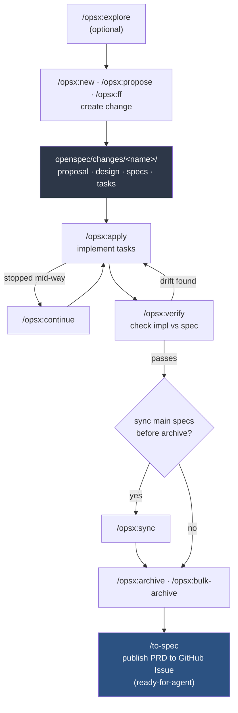

# Developer Guide: Spec-Driven Development (SDD)

This project uses spec-driven development: write the spec before the code, keep the spec and the code in sync, verify implementation against the spec before shipping.

Two toolchains are available and used together, not as alternatives:

- **OpenSpec** (`opsx:*` skills) — in-repo, file-based, drives the build loop (proposal → design → tasks → implement → verify → archive).
- **Matt Pocock's `to-spec`/`implement`** skills — conversation-to-spec synthesis, publishes to the GitHub issue tracker for an external durable record.

## Workflow diagram



**Setup once**, before step B: `openspec init` (or changes land outside the repo, silently), `gh auth login --scopes repo` (if not already authed), then `/setup-matt-pocock-skills` so `/to-spec` isn't a no-op later.

## One-time setup

```
openspec init
```

Run once, in-repo, before any `/opsx:*` command. Without it, `openspec` silently falls back to a global planning home at `~/openspec/changes/` instead of `<repo>/openspec/changes/` — changes get created outside the repo, untracked by git, with no error. If this was skipped and a change already landed under `~/openspec/changes/<name>/`, move it into `<repo>/openspec/changes/<name>/` by hand and delete the stray copy.

```
gh auth login --scopes repo
```

Required before `/setup-matt-pocock-skills` or `/to-spec` — both assume a working `gh` CLI session. Check first with `gh auth status`; re-run login if it reports an invalid/expired token.

```
/setup-matt-pocock-skills
```

Wires GitHub Issues as the issue tracker and configures the triage label vocabulary (`ready-for-agent`, etc.). Without this, `to-spec` no-ops.

## Workflow

### 1. Explore (optional)

```
/opsx:explore
```

Think through the idea, clarify requirements, investigate the problem before committing to a change. Skip if the ask is already well-understood.

### 2. Propose the change

```
/opsx:new        # step through proposal → design → specs → tasks one at a time
/opsx:propose    # generate all artifacts in one step
/opsx:ff         # fast-forward, skip stepping through
```

Produces `openspec/changes/<change-name>/`:
- `proposal.md` — what and why
- `design.md` — architecture/decisions
- `specs/` — delta specs (behavior changes)
- `tasks.md` — implementation checklist

This directory is the **source of truth** during the build. It's tracked in git.

### 3. Implement

```
/opsx:apply
```

Works through `tasks.md` from the change. Use `/opsx:continue` to progress to the next artifact if you stopped mid-way.

### 4. Verify

```
/opsx:verify
```

Checks implementation matches the change's specs and tasks before archiving. Don't skip this — it's the gate that catches drift between what was specced and what was built.

### 5. Sync specs into main (optional, without archiving)

```
/opsx:sync
```

Folds delta specs from the change into the project's main `openspec/specs/` directory. Use when you want the main spec set updated but the change isn't fully closed out yet.

### 6. Archive

```
/opsx:archive         # single change
/opsx:bulk-archive    # multiple completed changes at once
```

Finalizes the change once implementation is verified. Moves it out of active changes.

### 7. Publish final spec externally

```
/to-spec
```

Run **after** archive. Synthesizes the conversation + finished openspec artifacts (proposal, decisions, tasks) into a single PRD-style document, publishes it as a GitHub Issue tagged `ready-for-agent`. This is the external durable record — a mirror of what's already in-repo under `openspec/`, not a replacement for it.

Note: `to-spec` has `disable-model-invocation: true` — it must be invoked explicitly (`/to-spec`), it will never auto-trigger from conversation context.

## Rules of thumb

- **openspec drives the build** (has task tracking + verify gate). **to-spec publishes the result** (no task tracking, no verify — just synthesis + publish). Don't swap their order.
- Don't hand-write `openspec/` files outside the skill flow unless fixing a mistake — let `/opsx:new`/`/opsx:propose` generate them so structure stays consistent.
- If `to-spec` produces something that contradicts the openspec artifacts, the openspec change is authoritative (it went through `verify`); fix the published issue, not the other way around.
- `/opsx:onboard` — guided walkthrough of the full loop against real repo code, useful for first-time contributors instead of reading this doc cold.

## Quick reference

| Stage | Command |
|---|---|
| Explore idea | `/opsx:explore` |
| Create change | `/opsx:new` / `/opsx:propose` / `/opsx:ff` |
| Continue change | `/opsx:continue` |
| Implement tasks | `/opsx:apply` |
| Verify vs spec | `/opsx:verify` |
| Sync to main specs | `/opsx:sync` |
| Archive change | `/opsx:archive` / `/opsx:bulk-archive` |
| Publish to issue tracker | `/to-spec` |
| First-time walkthrough | `/opsx:onboard` |
